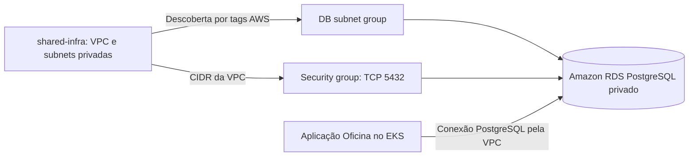

# Banco PostgreSQL da Oficina

Este repositório provisiona somente o PostgreSQL gerenciado (Amazon RDS) do sandbox da aplicação Oficina. Ele cria um RDS PostgreSQL privado, seu DB subnet group e um security group dedicado. Não cria VPC, subnets, EKS, IAM, Secrets Manager, observabilidade, migrations ou recursos Kubernetes.

## Arquitetura deste repositório



O diagrama mostra os recursos criados aqui e suas dependências externas; a aplicação gerencia as migrations em seu próprio repositório.

## Tecnologias utilizadas

Terraform, provider AWS, Amazon RDS PostgreSQL, VPC/security groups da AWS, S3 para o state, scripts Bash e GitHub Actions. Os testes estáticos usam Python `unittest`.

## Relação com a infraestrutura compartilhada

`shared-infra` deve ser aplicado primeiro. Este projeto presume que, em `us-east-1`, ele já criou uma VPC com `Name=sandbox-vpc` e `Environment=sandbox`, além de subnets privadas com `Environment=sandbox` e `Type=private` (hoje `10.0.10.0/24` e `10.0.11.0/24`).

O state do Terraform é persistido no S3 (`terraform-state-264040538379-us-east-1`) com a key `database/terraform.tfstate`. Não há compartilhamento de state com a infraestrutura principal nem uso de `terraform_remote_state`. Os data sources em `terraform/data.tf` encontram a rede diretamente na AWS por tags estáticas.

O repositório compartilhado não declara um security group de nós EKS com identificação estável para reutilização. Por isso, a entrada do RDS aceita PostgreSQL apenas do CIDR da VPC descoberta. Isso permite pods e nós do EKS nas subnets privadas acessarem a porta 5432, sem regra de Internet. É uma decisão simples e adequada ao sandbox; a regra PostgreSQL não usa `0.0.0.0/0`.

## Configuração do sandbox

`terraform/environments/sandbox/terraform.tfvars` define `oficina`, `oficina_admin`, PostgreSQL 16, `db.t4g.micro`, Single-AZ, gp3 com 20 GiB e retenção de um dia. `db.t4g.micro` é a menor classe burstable adequada; 20 GiB é o mínimo aceito pelo gp3 de RDS PostgreSQL. A senha não é versionada: use `TF_VAR_db_password`.

## Pré-requisitos e execução local

Requer Terraform 1.10+, AWS CLI autenticada com permissões para RDS/EC2 e a infraestrutura compartilhada aplicada. Defina a senha de forma segura e execute:

```bash
export TF_VAR_db_password='senha-fornecida-com-seguranca'
export TF_VAR_db_username='oficina_admin' # opcional; já é o padrão
terraform -chdir=terraform fmt -check
terraform -chdir=terraform init
terraform -chdir=terraform validate
python -m unittest discover tests -v
./scripts/plan-database.sh
```

Para aplicar conscientemente:

```bash
./scripts/apply-database.sh
```

Use `TFVARS_FILE=/caminho/arquivo.tfvars` para outro arquivo. Não coloque `db_password` em `.tfvars`.

## GitHub Actions

Configure os GitHub Secrets `AWS_ACCESS_KEY_ID`, `AWS_SECRET_ACCESS_KEY`, `AWS_SESSION_TOKEN`, `DB_USERNAME` e `DB_PASSWORD`. Pull requests executam format, init, validate, testes estáticos e plan. Pushes para `main` executam as mesmas verificações e então apply. As credenciais e a senha nunca são gravadas no workflow.

## Outputs e conexão da aplicação

Após o apply, `rds_endpoint`, `rds_port`, `database_name` e `database_username` correspondem a `DB_HOST`, `DB_PORT`, `DB_NAME` e `DB_USERNAME`. A aplicação fornece `DB_PASSWORD` pelo seu próprio fluxo. SQLAlchemy e Alembic permanecem no repositório da aplicação: este projeto não executa migrations.

## Documentação das APIs

Este repositório provisiona um banco e não expõe API HTTP, portanto não possui Swagger ou coleção Postman própria. A API que usa o banco é documentada no [Swagger da aplicação Oficina](https://github.com/douradorobert-pos-fiap-project/tech-challenge-fiap#documentação-da-api).
